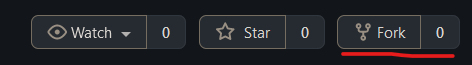
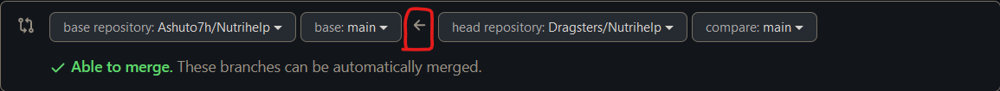
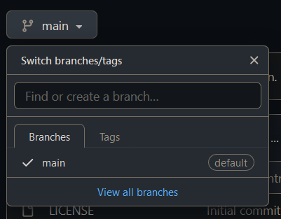

# Contributing Guidelines  
  
This documentation contains a set of guidelines to help you during the contribution process.   
Thank you for helping out and remember, **no contribution is too small.**  
  
# Submitting Contributions👩‍💻
Below you will find the process and workflow used to review and merge your changes.  
<br>You should have git installed in your pc for these steps.

## Step 0 : Fork and clone the Project 🍴
- Fork this Repository. This will create a Local Copy of this Repository on your Github Profile.



- If you have already forked the project, update your fork before working.
<br> create and merge a pull request to push changes from this repository to your fork.

the direction of arrow shows the code pushing direction. always name this pull request as **Fork Sync**
  
```bash
$ git remote update  
$ git checkout <branch-name>  
```  
to clone the project, open cmd where you want to place your project.
```bash
$ git clone https://github.com/Dragsters/Nutrihelp.git
```
## Step 1 : Find an issue  🔍
- Take a look at the **Existing Issues** or create your **own Issues!**  
- Wait for the Issue to be assigned to you after which you can start working on it.  
- Note : Every change in this project should/must have an associated issue.   
  
## Step 2 : Branch  🔖
Create a new branch with the issue name to identify the issue your addressing.  
<br>example - you are assigned issue 21

<br>create a new branch with name issue-21<br>


on local switch to that branch 
```bash  
$ git checkout origin/issue-21
# OR
$ git checkout issue-21
```

## Step 3 : Work on the issue assigned  📕
- Work on the issue(s) assigned to you.   
- Add all the files/folders needed.  
- After you've made changes or made your contribution to the project add changes to the branch you've just created by:  
```bash
# To add all new files to branch Branch_Name  
$ git add .  

```
  
## Step 4 : Commit  
- To commit give a descriptive message for the convenience of reviewer by:  
```bash
# This message get associated with all files you have changed  
$ git commit -m "message"  
```  
- **NOTE**: A PR should have only one commit. Multiple commits will be squashed. 
 
## Step 5 : Work Remotely  
- When your work is ready and complies with the project conventions, upload your changes to your fork:  
  
```bash
# To push your work to your fork repository  
$ git push -u origin <Branch_Name>
```  

## Step 6 : Pull Request  🎣
- Go to your repository in browser and click on compare and pull requests. notice the arrow direction and repository names.


Then fill the mandatory details according to given template.

- Voila! Your Pull Request has been submitted and will be reviewed and merged.🥳  
  
## Need more help?🤔  
watch youtube. Kuch nhi ho sakta tumhara.  

## Tip from us😇  
- we always recommend to use gui tools which came with IDE and editors for using git.
- It always takes time to understand and learn. So, do not worry at all.
